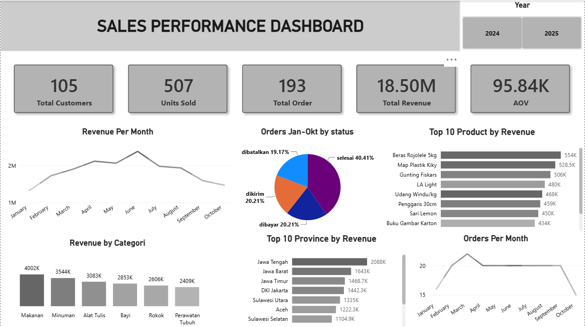

# Sales Performance Analysis

## Project Overview

This project analyzes sales performance for the period January–October 2024 and January–October 2025.

The analysis focuses on customer activity, product sales, order performance, revenue, average order value (AOV), product categories, geographic performance, and order cancellations.

The goal of this project is to identify changes in sales performance between 2024 and 2025 and provide actionable recommendations based on the analysis.

---

## Business Questions

The analysis aims to answer the following questions:

1. How did overall sales performance change between 2024 and 2025?
2. How did the number of customers, orders, and units sold change?
3. How did revenue and AOV change between the two periods?
4. Which product categories generated the most revenue?
5. Which categories experienced the largest increase or decrease?
6. Which provinces contributed the most revenue?
7. Which products generated the highest revenue?
8. How did the order cancellation rate change?
9. Which months showed significant changes in revenue and order volume?

---

## Dataset

The dataset consists of four main tables:

- `pelanggan` — customer information
- `produk` — product information
- `orders` — order transactions
- `detil_order` — order detail and product-level transactions

The analysis was performed using data from January–October 2024 and January–October 2025 to ensure a consistent comparison between the two years.

---

## Data Validation

Before performing the analysis, data validation was conducted using SQL Server.

The validation process included:

- Checking the total number of records
- Checking duplicate IDs
- Checking NULL values
- Checking unique values
- Checking invalid characters in categorical data
- Checking product prices and stock values
- Checking order dates and statuses
- Checking the consistency of order details
- Validating calculated subtotal values

The purpose of this step was to ensure that the data was sufficiently consistent before performing exploratory analysis.

---

## Exploratory Data Analysis

Exploratory Data Analysis (EDA) was performed using SQL Server to understand the characteristics and patterns within the dataset.

The analysis included:

### Customer Analysis

- Total number of customers
- Customer distribution by city
- Customer distribution by province
- Number of cities by province

### Product Analysis

- Total number of products
- Number of products by category
- Highest and lowest-priced products
- Average product price by category
- Total stock by category

### Order Analysis

- Total number of orders
- Orders by year
- Orders by month
- Average order value
- Average order value by year
- Orders by status
- Orders by customer province
- Cancelled orders by province
- Cancellation rate by province

---

## Data Transformation

The transactional tables were joined to create a consolidated sales analysis dataset.

The main relationships used were:

`pelanggan` → `orders` → `detil_order` → `produk`

The resulting dataset contains customer, product, order, and transaction-level information used for further analysis and visualization.

---

## Power BI Dashboard

The final dashboard was created using Power BI to visualize sales performance and compare 2024 with 2025.

### Dashboard includes:

- Total Customers
- Units Sold
- Total Orders
- Total Revenue
- Average Order Value (AOV)
- Revenue by Month
- Orders by Month
- Revenue by Category
- Top 10 Products by Revenue
- Top 10 Provinces by Revenue
- Orders by Status
- Year filter



---

## Key Insights

### 1. Revenue Performance

Revenue decreased from approximately **Rp9.78 million in 2024 to Rp8.72 million in 2025**, representing a **10.8% decline**.

The decline was accompanied by an **8.0% decrease in AOV** and a **13.6% decrease in units sold**, while total orders declined by only **3.1%**.

This indicates that the decline in revenue was associated not only with fewer orders, but also with lower transaction value and fewer units sold per order.

### 2. Category Performance

The **Stationery** category experienced the largest revenue decline, decreasing from approximately **Rp1.91 million to Rp1.18 million**, or **38.2%**.

Meanwhile, the **Baby** category increased by approximately **13.2%**, while **Beverages** increased by approximately **4.1%**.

This resulted in a change in category contribution, with Beverages becoming the highest-revenue category in 2025.

### 3. Regional Performance

**Central Java** remained the province with the highest revenue contribution in both periods.

However, its revenue decreased by approximately **25.7%**, from around Rp1.20 million to Rp890 thousand.

In contrast, **Jakarta** experienced approximately **23.5% growth** and moved from around sixth place to second place based on revenue.

### 4. Monthly Performance

Revenue and order volume showed a significant decline toward the end of the 2025 period.

In October 2025, the number of orders decreased to approximately **5 orders**, compared with around **10 orders in September**. Revenue also declined significantly during the same period.

### 5. Cancellation Rate

The cancellation rate increased from **18.37% in 2024 to 20% in 2025**, an increase of approximately **1.63 percentage points**.

This means that approximately one in five orders was cancelled during the 2025 period.

---

## Recommendations

Based on the findings, several recommendations can be considered:

1. **Investigate the Stationery category** to identify the products contributing most to its 38.2% revenue decline.

2. **Evaluate Central Java's sales performance** to understand the factors behind its 25.7% revenue decline.

3. **Explore the growth opportunity in Jakarta**, which showed 23.5% revenue growth and improved its position among the top provinces.

4. **Monitor cancellation patterns** and investigate the products, provinces, or periods associated with higher cancellation rates.

5. **Investigate the October 2025 decline** to identify factors associated with the sharp reduction in order volume and revenue.

6. **Maintain growth in the Baby and Beverage categories** while evaluating opportunities to increase their contribution to overall revenue.

---

## Tools

- **SQL Server** — Data validation and exploratory data analysis
- **SQL** — Data querying and transformation
- **Power BI** — Data visualization and dashboard development
- **DAX** — Measures and calculations in Power BI
- **VS Code** — Project documentation

---

## Project Structure

```text
E-commerce/
│
├── README.md
│
│
├── Dashboard/
│   └── Sales_Performance_Dashboard.png
│
├── Dataset/
│   ├── detil_order.csv
│   ├── orders.csv
│   ├── pelanggan.csv
│   └── produk.csv
│
├── Documentation/
│   └── Insights_and_Recommendations.md
│
│
├── Power BI/
│   └── Sales_Performance_Dashboard.pbix
│
│
└── SQL/
    └── Data Validation/
    │   ├── Validation_Detil_Order.sql
    │   ├── Validation_Orders.sql
    │   ├── Validation_Pelanggan.sql
    │   └── Validation_Produk.sql
    │
    └── EDA/
        ├── EDA_DetailOrder.sql
        ├── EDA_Orders.sql
        ├── EDA_Pelanggan.sql
        ├── EDA_Produk.sql
        └── Sales_analysis.sql
```
